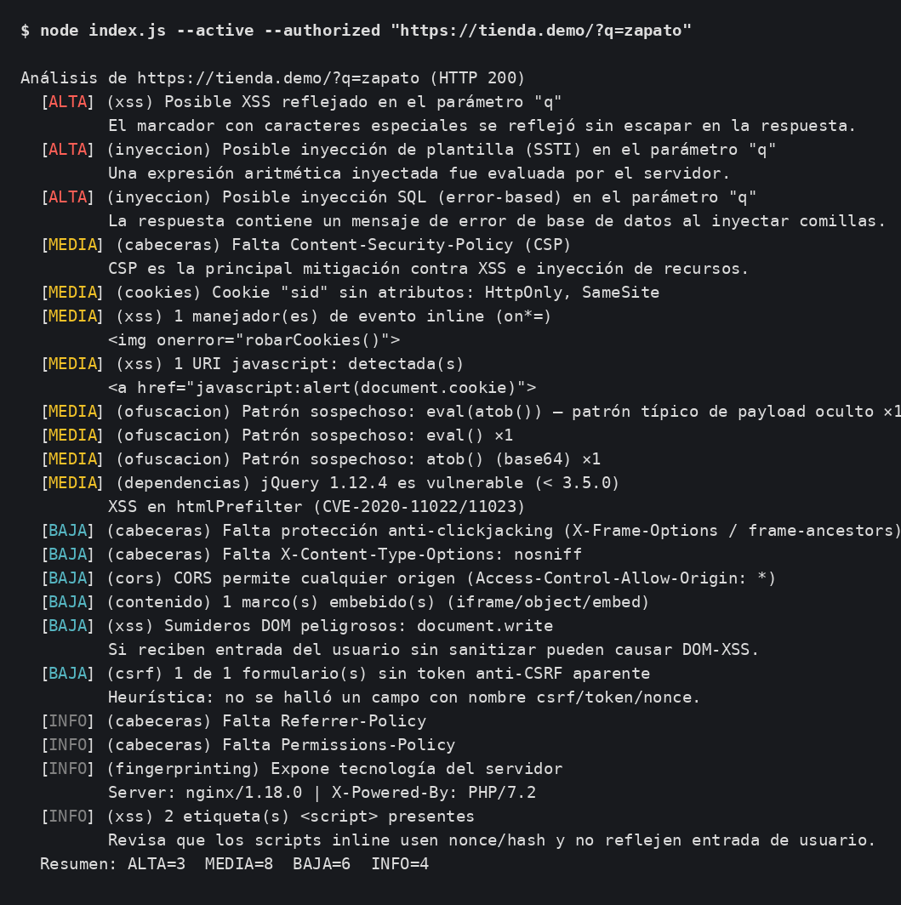

# Analizador de Vulnerabilidades Web

[](https://github.com/StraycoderX/Vulnerabilidades/actions/workflows/ci.yml)
[](https://github.com/StraycoderX/Vulnerabilidades/actions/workflows/codeql.yml)
[](https://github.com/StraycoderX/Vulnerabilidades/releases)
[](LICENSE)


Herramienta de consola en Node.js (sin dependencias) que descarga una página y
emite un reporte de seguridad con **niveles de severidad**: revisa cabeceras de
seguridad, vectores de XSS y patrones de código ofuscado.

> ⚠️ Es una herramienta de apoyo basada en heurísticas, no un escáner
> exhaustivo. Úsala solo sobre sitios para los que tengas autorización.




## Uso

```bash
node index.js                            # Modo interactivo (pregunta URLs)
node index.js <url> [<url>...]           # Analiza una o varias URLs y termina
node index.js --json <url>               # Salida JSON (para CI)
node index.js --sarif <url>              # Salida SARIF (GitHub Code Scanning)
node index.js --baseline base.json <url> # Reporta solo hallazgos NUEVOS vs. baseline
node index.js --input urls.txt           # Analiza URLs de un fichero (una por línea)
node index.js --concurrency N <urls>     # Escaneos en paralelo (por defecto 5)
node index.js --html <url>               # Reporte HTML
node index.js --crawl N [--max-pages M] <url>   # Rastrea el mismo origen (profundidad N)
node index.js --header "K: V" <url>      # Cabecera personalizada (repetible)
node index.js --cookie "k=v" <url>       # Escaneo autenticado con cookie de sesión
node index.js --active --authorized <url?p=x>   # Sonda de XSS reflejado (¡solo autorizado!)
node index.js --help                     # Ayuda
npm test                                 # Tests (node --test)
npm run check                            # Sintaxis + lint + tests
```

La primera ejecución con `--baseline` crea el fichero; las siguientes solo
muestran hallazgos nuevos (ideal para detectar regresiones en cada update).
Añade `--update-baseline` para refrescar la línea base tras el escaneo.

En modo interactivo, escribe `salir` (o pulsa Ctrl+C) para terminar.

**Código de salida (modo CLI):** `0` sin hallazgos altos/medios · `1` con
ellos · `2` si hubo errores. Útil para fallar un pipeline de CI.

## Arquitectura

El código está modularizado en `src/` con una **arquitectura de reglas**: cada
comprobación vive en `src/rules/` y emite hallazgos con `id` estable, severidad,
categoría y referencia. Añadir una regla nueva es crear un módulo y registrarlo
en `src/rules/index.js`. El motor (`src/engine.js`) tokeniza el HTML con un
**parser propio** (`src/parser.js`, sin dependencias), ejecuta las reglas y
ordena; el reporte (`src/report.js`) genera consola, JSON, SARIF y diff de
baseline (y reporte HTML); `src/pool.js` da la concurrencia, `src/tls.js` la
inspección TLS, `src/crawl.js` el rastreo de mismo origen y `src/active.js` la
sonda de XSS reflejado.

## Qué analiza

- **Cabeceras de seguridad:** CSP (incluida su **graduación**: `unsafe-inline`,
  `unsafe-eval`, comodines, falta de `object-src`/`base-uri`), HSTS,
  X-Frame-Options / `frame-ancestors`, X-Content-Type-Options, Referrer-Policy,
  Permissions-Policy, exposición de tecnología (`Server`/`X-Powered-By`).
- **CORS:** `Access-Control-Allow-Origin: *` (alta si va con credenciales).
- **Cookies:** sin `Secure`/`HttpOnly`/`SameSite`, `SameSite=None` sin `Secure`
  y prefijos `__Host-`/`__Secure-` mal configurados.
- **Métodos:** `TRACE`/`TRACK` anunciados (Cross-Site Tracing).
- **Vectores de XSS:** manejadores de evento inline (`on*=`), URIs `javascript:`,
  sumideros DOM (`innerHTML`, `document.write`…), marcos embebidos, *mixed
  content*, formularios sin token anti-CSRF aparente y posibles *open redirect*.
- **Ofuscación:** `eval()`, `eval(atob())`, `new Function(string)`, `unescape()`,
  `String.fromCharCode()` y cadenas con escapes `\xNN`/`\uNNNN` largos.
- **Librerías JS vulnerables** (estilo retire.js): jQuery, AngularJS, Bootstrap,
  Lodash y Moment.js con versiones de CVE conocidos.
- **TLS** (en sitios `https`): protocolo obsoleto (TLS 1.0/1.1, SSLv3 → alta) y
  certificado caducado o próximo a caducar.
- **Comprobaciones activas** (con `--active --authorized`, por parámetro de query):
  **XSS reflejado** (marcador inofensivo reflejado sin escapar), **SSTI** (expresión
  aritmética evaluada por la plantilla), **SQLi error-based** (firmas de error de BD),
  **open redirect** (redirección a dominio externo) y **DOM-XSS** (en modo headless).
- **Modo headless / DAST** (`--headless`): renderiza la página con un navegador real,
  por lo que analiza **SPAs**, detecta **violaciones de CSP en runtime** y errores JS.

## Crawling y escaneo autenticado

- `--crawl N [--max-pages M]`: rastrea enlaces del **mismo origen** por niveles
  (BFS) hasta profundidad N, revalidando anti-SSRF en cada URL.
- `--header "K: V"` (repetible) y `--cookie "k=v"`: envían cabeceras/cookies de
  sesión para analizar zonas autenticadas.

> ⚠️ El modo activo envía peticiones de prueba; úsalo **solo** sobre objetivos
> propios o con autorización explícita (`--authorized` es obligatorio).

## Modo headless (DAST) — dependencia opcional

`--headless` usa Playwright para renderizar la página. Es una **dependencia
opcional**: el resto de la herramienta funciona sin ella. Para habilitarlo:

```bash
npm install -D playwright
npx playwright install chromium
node index.js --headless https://tu-sitio.example/
```

Sin Playwright instalado, `--headless` muestra un mensaje con estas instrucciones
y no afecta a los demás modos.

## Controles de seguridad de la propia herramienta

- **Anti-SSRF:** resuelve el host y bloquea direcciones internas/privadas
  (loopback, link-local/metadata cloud `169.254.169.254`, rangos RFC 1918,
  IPv6 ULA/link-local e IPv4 embebido en IPv6 `::ffff:`). Solo `http`/`https`.
- **Anti DNS-rebinding:** la conexión se fija a la IP ya validada, evitando que
  el host resuelva a otra IP entre la validación y la conexión.
- **Timeout** de petición (10 s) y **límite de tamaño** de respuesta (5 MB, anti-DoS).
- **Verificación TLS** explícita y **redirecciones** controladas (máx. 5,
  revalidando anti-SSRF en cada salto).

## Docker y GitHub Action

```bash
docker build -t analizador-vuln .
docker run --rm analizador-vuln --json https://example.com
```

Como Action reutilizable en un workflow:

```yaml
- uses: StraycoderX/Vulnerabilidades@main
  with:
    url: https://example.com
    format: --sarif
```

## Integración continua

- **CI** (`.github/workflows/ci.yml`): en cada push/PR ejecuta `node --check`,
  ESLint, **typecheck (`tsc --checkJs`)**, tests (unitarios + integración) y
  `npm audit` (chequeo estructural).
- **CodeQL** (`.github/workflows/codeql.yml`): análisis de seguridad del código
  en cada push/PR y semanalmente.
- **Escaneo web** (`.github/workflows/security-scan.yml`): lanzable a mano con
  una URL; sube los hallazgos en SARIF a la pestaña *Security*.

## Próximas mejoras sugeridas

- Mantener al día la base de firmas de librerías vulnerables.
- Respetar `robots.txt` y añadir rate-limiting cortés al crawler.
- Publicar en npm y como imagen en un registry de contenedores.
